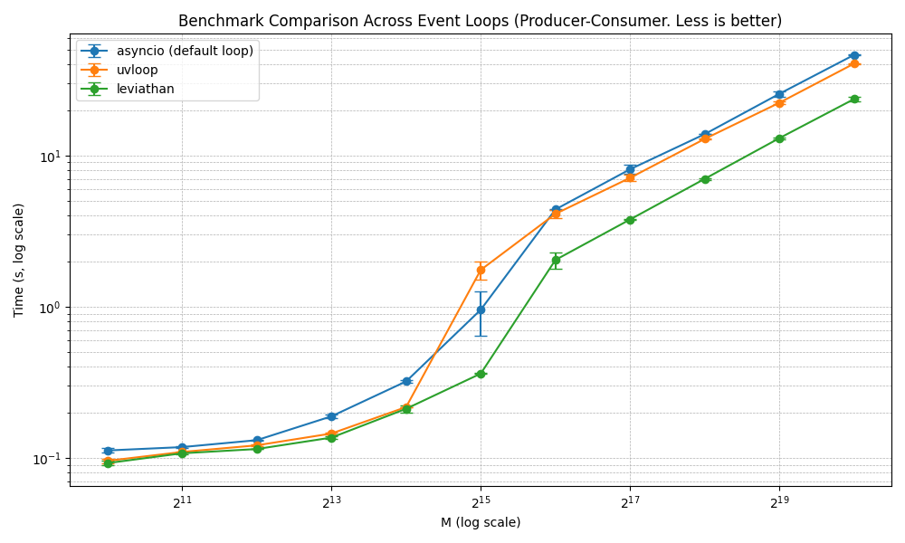

# Leviathan Benchmarking Results

This page presents the benchmarking results for Leviathan, showcasing its performance and efficiency compared to other event loops. The tests compare the implementation of the asyncio standard event loop, uvloop, Leviathan (single thread mode) and Leviathan (thread-safe).

### Test Environment

- **CPU**: 12th Gen Intel(R) Core(TM) i7-1255U
- **Operating System**: Linux Kernel 6.12.6-zen1-1-zen

---

### Axis Explanation

In the benchmark charts:

- The **X-axis** represents various metrics, usually the number of events or tasks processed.
- The **Y-axis** represents the time taken to complete the test. Lower values indicate better performance.

## Benchmark Tests

### Test 1: Producer - Consumer

For more information, refer to the [code repository](benchmarks/producer_consumer.py).

```
+------------------------+---------+-----------+-----------+-----------+-----------+------------+----------------+
|          Loop          |    M    |  Min (s)  |  Max (s)  |  Avg (s)  | Stdev (s) |  Diff (s)  | Relative Speed |
+------------------------+---------+-----------+-----------+-----------+-----------+------------+----------------+
| asyncio (default loop) |   1024  |  0.107900 |  0.115966 |  0.111933 |  0.005703 |  0.000000  |    1.000000    |
| asyncio (default loop) |   2048  |  0.115963 |  0.119679 |  0.117821 |  0.002628 |  0.000000  |    1.000000    |
| asyncio (default loop) |   4096  |  0.130585 |  0.131264 |  0.130925 |  0.000480 |  0.000000  |    1.000000    |
| asyncio (default loop) |   8192  |  0.183919 |  0.192665 |  0.188292 |  0.006184 |  0.000000  |    1.000000    |
| asyncio (default loop) |  16384  |  0.312601 |  0.327954 |  0.320277 |  0.010856 |  0.000000  |    1.000000    |
| asyncio (default loop) |  32768  |  0.645820 |  1.264127 |  0.954974 |  0.437209 |  0.000000  |    1.000000    |
| asyncio (default loop) |  65536  |  4.392356 |  4.401943 |  4.397150 |  0.006779 |  0.000000  |    1.000000    |
| asyncio (default loop) |  131072 |  7.527852 |  8.697494 |  8.112673 |  0.827062 |  0.000000  |    1.000000    |
| asyncio (default loop) |  262144 | 13.804951 | 13.902445 | 13.853698 |  0.068939 |  0.000000  |    1.000000    |
| asyncio (default loop) |  524288 | 24.510814 | 26.715789 | 25.613302 |  1.559153 |  0.000000  |    1.000000    |
| asyncio (default loop) | 1048576 | 45.949512 | 46.698510 | 46.324011 |  0.529622 |  0.000000  |    1.000000    |
|         uvloop         |   1024  |  0.092444 |  0.098714 |  0.095579 |  0.004433 | -0.016354  |    1.171102    |
|         uvloop         |   2048  |  0.109109 |  0.109736 |  0.109423 |  0.000443 | -0.008398  |    1.076752    |
|         uvloop         |   4096  |  0.118710 |  0.123408 |  0.121059 |  0.003322 | -0.009866  |    1.081496    |
|         uvloop         |   8192  |  0.143010 |  0.146783 |  0.144897 |  0.002668 | -0.043395  |    1.299488    |
|         uvloop         |  16384  |  0.216536 |  0.217048 |  0.216792 |  0.000362 | -0.103485  |    1.477347    |
|         uvloop         |  32768  |  1.503782 |  1.999350 |  1.751566 |  0.350419 |  0.796592  |    0.545211    |
|         uvloop         |  65536  |  3.859538 |  4.367937 |  4.113738 |  0.359493 | -0.283412  |    1.068894    |
|         uvloop         |  131072 |  6.818890 |  7.420584 |  7.119737 |  0.425461 | -0.992936  |    1.139462    |
|         uvloop         |  262144 | 12.840444 | 12.932960 | 12.886702 |  0.065419 | -0.966996  |    1.075038    |
|         uvloop         |  524288 | 21.834759 | 22.864551 | 22.349655 |  0.728173 | -3.263647  |    1.146027    |
|         uvloop         | 1048576 | 40.315278 | 40.792247 | 40.553763 |  0.337269 | -5.770248  |    1.142286    |
|       leviathan        |   1024  |  0.088973 |  0.095683 |  0.092328 |  0.004745 | -0.019605  |    1.212345    |
|       leviathan        |   2048  |  0.105567 |  0.108874 |  0.107220 |  0.002338 | -0.010601  |    1.098867    |
|       leviathan        |   4096  |  0.114407 |  0.114438 |  0.114422 |  0.000022 | -0.016502  |    1.144221    |
|       leviathan        |   8192  |  0.133227 |  0.139114 |  0.136170 |  0.004163 | -0.052121  |    1.382766    |
|       leviathan        |  16384  |  0.199501 |  0.222852 |  0.211176 |  0.016512 | -0.109101  |    1.516635    |
|       leviathan        |  32768  |  0.358296 |  0.363813 |  0.361055 |  0.003901 | -0.593919  |    2.644956    |
|       leviathan        |  65536  |  1.793467 |  2.283503 |  2.038485 |  0.346508 | -2.358665  |    2.157068    |
|       leviathan        |  131072 |  3.764409 |  3.787585 |  3.775997 |  0.016388 | -4.336676  |    2.148485    |
|       leviathan        |  262144 |  6.913869 |  7.110454 |  7.012161 |  0.139007 | -6.841537  |    1.975667    |
|       leviathan        |  524288 | 12.859841 | 13.209249 | 13.034545 |  0.247069 | -12.578757 |    1.965032    |
|       leviathan        | 1048576 | 22.965483 | 24.305477 | 23.635480 |  0.947519 | -22.688531 |    1.959935    |
+------------------------+---------+-----------+-----------+-----------+-----------+------------+----------------+
```



---

### Test 2: Task Workflow

For more information, refer to the [code repository](benchmarks/task_workflow.py).

```
+------------------------+---------+-----------+-----------+-----------+-----------+------------+----------------+
|          Loop          |    M    |  Min (s)  |  Max (s)  |  Avg (s)  | Stdev (s) |  Diff (s)  | Relative Speed |
+------------------------+---------+-----------+-----------+-----------+-----------+------------+----------------+
| asyncio (default loop) |   1024  |  0.127057 |  0.151436 |  0.139246 |  0.017239 |  0.000000  |    1.000000    |
| asyncio (default loop) |   2048  |  0.160157 |  0.218112 |  0.189135 |  0.040980 |  0.000000  |    1.000000    |
| asyncio (default loop) |   4096  |  0.234018 |  0.282064 |  0.258041 |  0.033973 |  0.000000  |    1.000000    |
| asyncio (default loop) |   8192  |  0.516683 |  0.524914 |  0.520798 |  0.005820 |  0.000000  |    1.000000    |
| asyncio (default loop) |  16384  |  0.917817 |  0.966892 |  0.942354 |  0.034701 |  0.000000  |    1.000000    |
| asyncio (default loop) |  32768  |  2.235200 |  2.273679 |  2.254439 |  0.027208 |  0.000000  |    1.000000    |
| asyncio (default loop) |  65536  |  5.229966 |  5.342016 |  5.285991 |  0.079231 |  0.000000  |    1.000000    |
| asyncio (default loop) |  131072 | 10.827959 | 11.219877 | 11.023918 |  0.277128 |  0.000000  |    1.000000    |
| asyncio (default loop) |  262144 | 21.337912 | 21.956492 | 21.647202 |  0.437402 |  0.000000  |    1.000000    |
| asyncio (default loop) |  524288 | 41.550956 | 43.397680 | 42.474318 |  1.305831 |  0.000000  |    1.000000    |
| asyncio (default loop) | 1048576 | 82.240899 | 84.061960 | 83.151429 |  1.287685 |  0.000000  |    1.000000    |
|         uvloop         |   1024  |  0.120454 |  0.120605 |  0.120530 |  0.000107 | -0.018717  |    1.155286    |
|         uvloop         |   2048  |  0.139234 |  0.140528 |  0.139881 |  0.000915 | -0.049253  |    1.352108    |
|         uvloop         |   4096  |  0.174565 |  0.176609 |  0.175587 |  0.001445 | -0.082454  |    1.469593    |
|         uvloop         |   8192  |  0.253666 |  0.259348 |  0.256507 |  0.004018 | -0.264291  |    2.030347    |
|         uvloop         |  16384  |  0.452034 |  0.668463 |  0.560248 |  0.153039 | -0.382106  |    1.682029    |
|         uvloop         |  32768  |  1.655402 |  2.024253 |  1.839827 |  0.260818 | -0.414612  |    1.225354    |
|         uvloop         |  65536  |  4.028400 |  4.612829 |  4.320615 |  0.413254 | -0.965376  |    1.223435    |
|         uvloop         |  131072 |  9.094632 |  9.169152 |  9.131892 |  0.052693 | -1.892025  |    1.207189    |
|         uvloop         |  262144 | 16.986346 | 17.414757 | 17.200552 |  0.302932 | -4.446651  |    1.258518    |
|         uvloop         |  524288 | 34.543052 | 37.126208 | 35.834630 |  1.826567 | -6.639688  |    1.185287    |
|         uvloop         | 1048576 | 66.681928 | 67.025108 | 66.853518 |  0.242665 | -16.297912 |    1.243785    |
|       leviathan        |   1024  |  0.120644 |  0.124315 |  0.122480 |  0.002596 | -0.016766  |    1.136892    |
|       leviathan        |   2048  |  0.133721 |  0.133862 |  0.133791 |  0.000100 | -0.055343  |    1.413653    |
|       leviathan        |   4096  |  0.161885 |  0.168375 |  0.165130 |  0.004589 | -0.092911  |    1.562656    |
|       leviathan        |   8192  |  0.235872 |  0.330305 |  0.283089 |  0.066774 | -0.237710  |    1.839701    |
|       leviathan        |  16384  |  0.552610 |  0.562781 |  0.557696 |  0.007192 | -0.384659  |    1.689728    |
|       leviathan        |  32768  |  1.152408 |  1.378963 |  1.265686 |  0.160199 | -0.988754  |    1.781200    |
|       leviathan        |  65536  |  2.849616 |  2.933861 |  2.891739 |  0.059571 | -2.394253  |    1.827963    |
|       leviathan        |  131072 |  5.795879 |  6.045244 |  5.920562 |  0.176328 | -5.103356  |    1.861972    |
|       leviathan        |  262144 | 12.161393 | 12.269680 | 12.215537 |  0.076571 | -9.431666  |    1.772104    |
|       leviathan        |  524288 | 22.154078 | 24.456344 | 23.305211 |  1.627948 | -19.169107 |    1.822524    |
|       leviathan        | 1048576 | 46.104646 | 62.099787 | 54.102216 | 11.310272 | -29.049213 |    1.536932    |
+------------------------+---------+-----------+-----------+-----------+-----------+------------+----------------+
```


---

### Test 3: Event Fiesta Factory

For more information, refer to the [code repository](benchmarks/event_fiesta_factory.py).

```
+------------------------+---------+-----------+-----------+-----------+-----------+-----------+----------------+
|          Loop          |    M    |  Min (s)  |  Max (s)  |  Avg (s)  | Stdev (s) |  Diff (s) | Relative Speed |
+------------------------+---------+-----------+-----------+-----------+-----------+-----------+----------------+
| asyncio (default loop) |   1024  |  0.010346 |  0.011887 |  0.011116 |  0.001089 |  0.000000 |    1.000000    |
| asyncio (default loop) |   2048  |  0.019847 |  0.021661 |  0.020754 |  0.001283 |  0.000000 |    1.000000    |
| asyncio (default loop) |   4096  |  0.040602 |  0.069404 |  0.055003 |  0.020366 |  0.000000 |    1.000000    |
| asyncio (default loop) |   8192  |  0.082648 |  0.123265 |  0.102957 |  0.028721 |  0.000000 |    1.000000    |
| asyncio (default loop) |  16384  |  0.215795 |  0.252983 |  0.234389 |  0.026296 |  0.000000 |    1.000000    |
| asyncio (default loop) |  32768  |  0.627104 |  0.648654 |  0.637879 |  0.015238 |  0.000000 |    1.000000    |
| asyncio (default loop) |  65536  |  1.347399 |  1.376929 |  1.362164 |  0.020881 |  0.000000 |    1.000000    |
| asyncio (default loop) |  131072 |  2.900018 |  3.487678 |  3.193848 |  0.415539 |  0.000000 |    1.000000    |
| asyncio (default loop) |  262144 |  6.126627 |  7.005428 |  6.566027 |  0.621406 |  0.000000 |    1.000000    |
| asyncio (default loop) |  524288 | 12.424012 | 13.758091 | 13.091051 |  0.943336 |  0.000000 |    1.000000    |
| asyncio (default loop) | 1048576 | 23.894121 | 27.155122 | 25.524621 |  2.305876 |  0.000000 |    1.000000    |
|         uvloop         |   1024  |  0.007194 |  0.007435 |  0.007315 |  0.000170 | -0.003802 |    1.519717    |
|         uvloop         |   2048  |  0.016500 |  0.017563 |  0.017031 |  0.000752 | -0.003723 |    1.218591    |
|         uvloop         |   4096  |  0.036401 |  0.037218 |  0.036809 |  0.000578 | -0.018193 |    1.494254    |
|         uvloop         |   8192  |  0.070533 |  0.071062 |  0.070798 |  0.000374 | -0.032159 |    1.454240    |
|         uvloop         |  16384  |  0.606659 |  1.088193 |  0.847426 |  0.340496 |  0.613037 |    0.276589    |
|         uvloop         |  32768  |  0.761164 |  1.258156 |  1.009660 |  0.351426 |  0.371781 |    0.631776    |
|         uvloop         |  65536  |  2.566296 |  2.729950 |  2.648123 |  0.115720 |  1.285959 |    0.514388    |
|         uvloop         |  131072 |  3.724974 |  4.350049 |  4.037512 |  0.441995 |  0.843663 |    0.791044    |
|         uvloop         |  262144 |  6.570276 |  8.481834 |  7.526055 |  1.351676 |  0.960028 |    0.872439    |
|         uvloop         |  524288 | 14.406829 | 14.738037 | 14.572433 |  0.234199 |  1.481381 |    0.898344    |
|         uvloop         | 1048576 | 26.092999 | 27.471274 | 26.782136 |  0.974588 |  1.257515 |    0.953047    |
|       leviathan        |   1024  |  0.006089 |  0.006731 |  0.006410 |  0.000454 | -0.004706 |    1.734229    |
|       leviathan        |   2048  |  0.014357 |  0.020749 |  0.017553 |  0.004520 | -0.003200 |    1.182325    |
|       leviathan        |   4096  |  0.031436 |  0.037656 |  0.034546 |  0.004398 | -0.020456 |    1.592146    |
|       leviathan        |   8192  |  0.054607 |  0.063765 |  0.059186 |  0.006476 | -0.043771 |    1.739546    |
|       leviathan        |  16384  |  0.112335 |  0.133128 |  0.122731 |  0.014702 | -0.111657 |    1.909770    |
|       leviathan        |  32768  |  0.232965 |  0.244166 |  0.238565 |  0.007920 | -0.399314 |    2.673813    |
|       leviathan        |  65536  |  0.475073 |  0.486988 |  0.481030 |  0.008425 | -0.881133 |    2.831762    |
|       leviathan        |  131072 |  2.909949 |  3.599523 |  3.254736 |  0.487602 |  0.060888 |    0.981293    |
|       leviathan        |  262144 |  6.339513 |  6.400835 |  6.370174 |  0.043361 | -0.195853 |    1.030745    |
|       leviathan        |  524288 | 11.555531 | 13.295061 | 12.425296 |  1.230033 | -0.665755 |    1.053581    |
|       leviathan        | 1048576 | 21.623536 | 23.017445 | 22.320491 |  0.985643 | -3.204131 |    1.143551    |
+------------------------+---------+-----------+-----------+-----------+-----------+-----------+----------------+
```


---

### Test 4: Chat

For more information, refer to the [code repository](benchmarks/chat.py).

```
+------------------------+---------+------------+------------+------------+-----------+------------+----------------+
|          Loop          |    M    |  Min (s)   |  Max (s)   |  Avg (s)   | Stdev (s) |  Diff (s)  | Relative Speed |
+------------------------+---------+------------+------------+------------+-----------+------------+----------------+
| asyncio (default loop) |   1024  |  1.272585  |  1.280174  |  1.276379  |  0.005366 |  0.000000  |    1.000000    |
| asyncio (default loop) |   2048  |  1.291826  |  1.293130  |  1.292478  |  0.000922 |  0.000000  |    1.000000    |
| asyncio (default loop) |   4096  |  1.303679  |  1.345254  |  1.324467  |  0.029398 |  0.000000  |    1.000000    |
| asyncio (default loop) |   8192  |  1.366864  |  1.394623  |  1.380744  |  0.019629 |  0.000000  |    1.000000    |
| asyncio (default loop) |  16384  |  1.724131  |  1.767364  |  1.745747  |  0.030570 |  0.000000  |    1.000000    |
| asyncio (default loop) |  32768  |  3.362839  |  3.409630  |  3.386235  |  0.033086 |  0.000000  |    1.000000    |
| asyncio (default loop) |  65536  |  7.304297  |  7.386933  |  7.345615  |  0.058432 |  0.000000  |    1.000000    |
| asyncio (default loop) |  131072 | 17.625613  | 17.805129  | 17.715371  |  0.126937 |  0.000000  |    1.000000    |
| asyncio (default loop) |  262144 | 39.302438  | 39.314999  | 39.308719  |  0.008882 |  0.000000  |    1.000000    |
| asyncio (default loop) |  524288 | 79.627248  | 80.729296  | 80.178272  |  0.779265 |  0.000000  |    1.000000    |
| asyncio (default loop) | 1048576 | 162.580935 | 164.195629 | 163.388282 |  1.141761 |  0.000000  |    1.000000    |
|         uvloop         |   1024  |  1.271846  |  1.274129  |  1.272988  |  0.001615 | -0.003392  |    1.002664    |
|         uvloop         |   2048  |  1.281618  |  1.293722  |  1.287670  |  0.008559 | -0.004808  |    1.003734    |
|         uvloop         |   4096  |  1.293273  |  1.298718  |  1.295996  |  0.003850 | -0.028471  |    1.021968    |
|         uvloop         |   8192  |  1.337239  |  1.341778  |  1.339509  |  0.003209 | -0.041235  |    1.030784    |
|         uvloop         |  16384  |  1.646016  |  1.699129  |  1.672572  |  0.037557 | -0.073175  |    1.043750    |
|         uvloop         |  32768  |  2.885666  |  2.899621  |  2.892643  |  0.009868 | -0.493591  |    1.170637    |
|         uvloop         |  65536  |  6.148146  |  6.160541  |  6.154344  |  0.008764 | -1.191271  |    1.193566    |
|         uvloop         |  131072 | 14.443860  | 14.808026  | 14.625943  |  0.257504 | -3.089429  |    1.211229    |
|         uvloop         |  262144 | 31.380859  | 31.504866  | 31.442862  |  0.087686 | -7.865856  |    1.250163    |
|         uvloop         |  524288 | 63.128558  | 63.977493  | 63.553025  |  0.600288 | -16.625246 |    1.261596    |
|         uvloop         | 1048576 | 125.395901 | 127.360985 | 126.378443 |  1.389524 | -37.009839 |    1.292849    |
|       leviathan        |   1024  |  1.268449  |  1.281048  |  1.274748  |  0.008909 | -0.001631  |    1.001279    |
|       leviathan        |   2048  |  1.283763  |  1.306287  |  1.295025  |  0.015927 |  0.002547  |    0.998033    |
|       leviathan        |   4096  |  1.287767  |  1.293023  |  1.290395  |  0.003716 | -0.034072  |    1.026404    |
|       leviathan        |   8192  |  1.328419  |  1.333955  |  1.331187  |  0.003915 | -0.049556  |    1.037227    |
|       leviathan        |  16384  |  1.505931  |  1.508898  |  1.507414  |  0.002098 | -0.238333  |    1.158107    |
|       leviathan        |  32768  |  2.282196  |  2.309554  |  2.295875  |  0.019345 | -1.090360  |    1.474921    |
|       leviathan        |  65536  |  4.441521  |  4.466636  |  4.454079  |  0.017759 | -2.891536  |    1.649188    |
|       leviathan        |  131072 |  9.306755  |  9.494513  |  9.400634  |  0.132765 | -8.314737  |    1.884487    |
|       leviathan        |  262144 | 19.990024  | 20.497646  | 20.243835  |  0.358943 | -19.064883 |    1.941762    |
|       leviathan        |  524288 | 43.477294  | 43.643038  | 43.560166  |  0.117199 | -36.618106 |    1.840633    |
|       leviathan        | 1048576 | 86.991097  | 88.518213  | 87.754655  |  1.079834 | -75.633627 |    1.861876    |
+------------------------+---------+------------+------------+------------+-----------+------------+----------------+
```


---

### Test 5: Food Delivery

For more information, refer to the [code repository](benchmarks/food_delivery.py).

```
+------------------------+---------+-----------+-----------+-----------+-----------+-----------+----------------+
|          Loop          |    M    |  Min (s)  |  Max (s)  |  Avg (s)  | Stdev (s) |  Diff (s) | Relative Speed |
+------------------------+---------+-----------+-----------+-----------+-----------+-----------+----------------+
| asyncio (default loop) |   1024  |  0.211308 |  0.213327 |  0.212317 |  0.001428 |  0.000000 |    1.000000    |
| asyncio (default loop) |   2048  |  0.222496 |  0.223345 |  0.222921 |  0.000600 |  0.000000 |    1.000000    |
| asyncio (default loop) |   4096  |  0.128954 |  0.247167 |  0.188061 |  0.083589 |  0.000000 |    1.000000    |
| asyncio (default loop) |   8192  |  0.254461 |  0.261041 |  0.257751 |  0.004653 |  0.000000 |    1.000000    |
| asyncio (default loop) |  16384  |  0.292351 |  0.334420 |  0.313386 |  0.029747 |  0.000000 |    1.000000    |
| asyncio (default loop) |  32768  |  0.419726 |  0.461757 |  0.440742 |  0.029720 |  0.000000 |    1.000000    |
| asyncio (default loop) |  65536  |  0.798663 |  0.853188 |  0.825926 |  0.038555 |  0.000000 |    1.000000    |
| asyncio (default loop) |  131072 |  1.753159 |  1.934372 |  1.843765 |  0.128137 |  0.000000 |    1.000000    |
| asyncio (default loop) |  262144 |  4.162022 |  4.596192 |  4.379107 |  0.307005 |  0.000000 |    1.000000    |
| asyncio (default loop) |  524288 |  7.908505 |  8.763527 |  8.336016 |  0.604592 |  0.000000 |    1.000000    |
| asyncio (default loop) | 1048576 | 16.013797 | 18.205098 | 17.109448 |  1.549483 |  0.000000 |    1.000000    |
|         uvloop         |   1024  |  0.208963 |  0.209252 |  0.209107 |  0.000204 | -0.003210 |    1.015351    |
|         uvloop         |   2048  |  0.218014 |  0.223649 |  0.220831 |  0.003985 | -0.002089 |    1.009461    |
|         uvloop         |   4096  |  0.228359 |  0.237799 |  0.233079 |  0.006676 |  0.045018 |    0.806854    |
|         uvloop         |   8192  |  0.239403 |  0.248608 |  0.244006 |  0.006509 | -0.013745 |    1.056332    |
|         uvloop         |  16384  |  0.269258 |  0.277195 |  0.273226 |  0.005612 | -0.040159 |    1.146982    |
|         uvloop         |  32768  |  0.386610 |  0.410715 |  0.398662 |  0.017045 | -0.042079 |    1.105551    |
|         uvloop         |  65536  |  0.638393 |  0.707895 |  0.673144 |  0.049145 | -0.152782 |    1.226968    |
|         uvloop         |  131072 |  1.512371 |  1.518674 |  1.515523 |  0.004457 | -0.328243 |    1.216587    |
|         uvloop         |  262144 |  3.393324 |  3.655358 |  3.524341 |  0.185286 | -0.854767 |    1.242532    |
|         uvloop         |  524288 |  6.909785 |  8.280827 |  7.595306 |  0.969473 | -0.740710 |    1.097522    |
|         uvloop         | 1048576 | 15.118598 | 16.172694 | 15.645646 |  0.745359 | -1.463802 |    1.093560    |
|       leviathan        |   1024  |  0.207784 |  0.209884 |  0.208834 |  0.001485 | -0.003484 |    1.016682    |
|       leviathan        |   2048  |  0.216396 |  0.217517 |  0.216956 |  0.000792 | -0.005964 |    1.027490    |
|       leviathan        |   4096  |  0.224716 |  0.231139 |  0.227927 |  0.004542 |  0.039867 |    0.825090    |
|       leviathan        |   8192  |  0.237418 |  0.243601 |  0.240510 |  0.004372 | -0.017241 |    1.071686    |
|       leviathan        |  16384  |  0.266751 |  0.273493 |  0.270122 |  0.004767 | -0.043264 |    1.160164    |
|       leviathan        |  32768  |  0.333456 |  0.334993 |  0.334224 |  0.001087 | -0.106517 |    1.318700    |
|       leviathan        |  65536  |  0.583910 |  0.594793 |  0.589352 |  0.007696 | -0.236574 |    1.401414    |
|       leviathan        |  131072 |  1.171196 |  1.228699 |  1.199948 |  0.040661 | -0.643818 |    1.536538    |
|       leviathan        |  262144 |  2.413656 |  2.507309 |  2.460482 |  0.066222 | -1.918625 |    1.779776    |
|       leviathan        |  524288 |  5.080067 |  5.668111 |  5.374089 |  0.415810 | -2.961927 |    1.551150    |
|       leviathan        | 1048576 |  9.865883 | 11.172825 | 10.519354 |  0.924148 | -6.590094 |    1.626473    |
+------------------------+---------+-----------+-----------+-----------+-----------+-----------+----------------+
```


